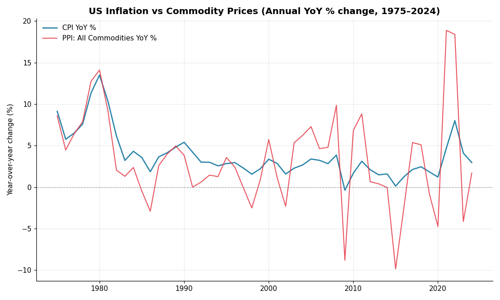
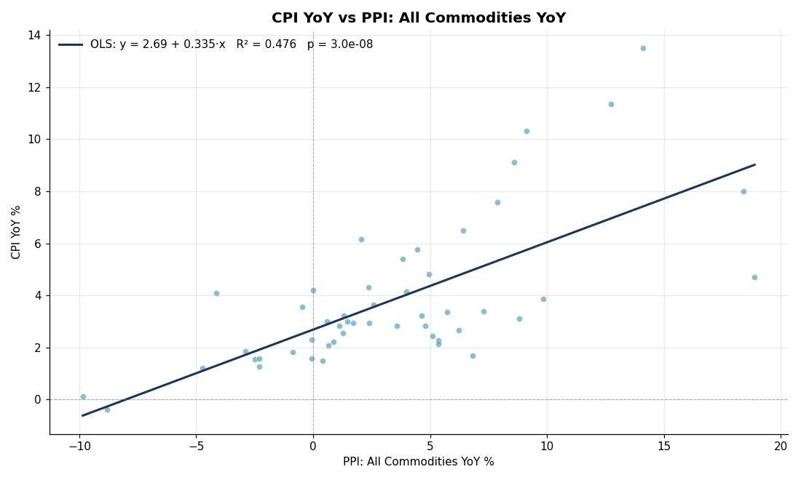
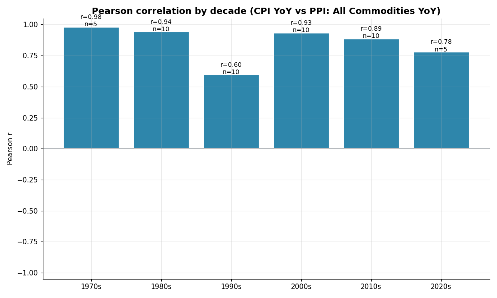
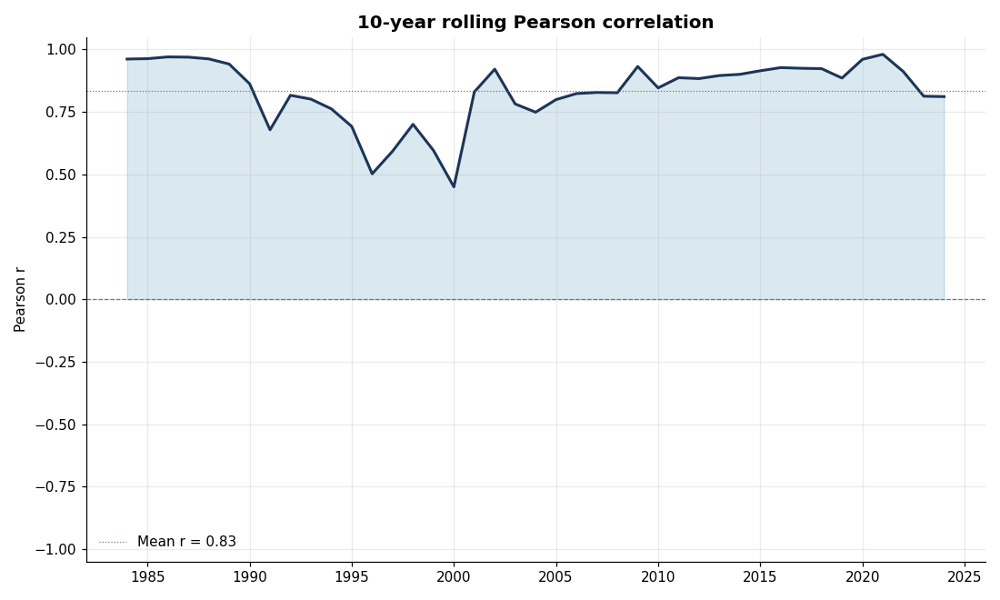

# US Inflation vs. Commodity Prices: Does the CFA Textbook Hold?

**TL;DR — Yes.** Over the last 50 years (1975–2024), US headline CPI year-over-year change is strongly and significantly positively correlated with US producer-side commodity prices. Pearson **r = 0.69** (p ≈ 3 × 10⁻⁸, n = 50). The relationship holds in **every decade**, and the rolling 10-year correlation never turns negative.

## Why this project

CFA Level I and Level II curricula assert a positive correlation between commodity prices and consumer price inflation, on the grounds that commodities are upstream inputs to nearly every consumer good. This repo tests that claim against actual US data and quantifies how strong the relationship really is, how stable it is across regimes, and where it breaks down.

## Headline result



The two series move together visibly across all five decades. The 1979–80 oil shock, 2008 commodity spike, 2014–15 oil collapse, and the 2021–22 post-COVID surge are all clearly synchronized.

| Statistic | Value | Interpretation |
|---|---|---|
| Pearson r | **0.690** | Strong positive linear relationship |
| Spearman ρ | 0.664 | Robust to outliers / non-linearity |
| OLS slope | 0.335 | A 1pp jump in commodity inflation ≈ 0.34pp jump in CPI |
| R² | 0.476 | Commodity prices alone explain ~48% of CPI variance |
| p-value | 3.0 × 10⁻⁸ | Strongly significant; n = 50 annual obs |



## Stability across regimes

The correlation is positive in **every decade since 1975**, with values ranging from 0.60 (1990s) to 0.98 (1970s).



| Decade | n | Pearson r | Notes |
|---|---|---|---|
| 1970s | 5 | 0.98 | Stagflation: oil shocks dominate everything |
| 1980s | 10 | 0.94 | Volcker disinflation + oil glut |
| 1990s | 10 | 0.60 | Weakest decade — commodity deflation, services-led CPI |
| 2000s | 10 | 0.93 | China commodity supercycle + 2008 spike |
| 2010s | 10 | 0.89 | Includes 2014–15 oil crash; correlation still high |
| 2020s | 5 | 0.78 | COVID disinflation → 2022 spike |

The 1990s are the weakest case, and the reason is intuitive: US inflation that decade was driven by services (healthcare, housing, education) while goods/commodity prices were structurally falling thanks to globalization. Even so, the correlation remained meaningfully positive.

## Rolling correlation



A 10-year rolling Pearson correlation has averaged **0.83** since 1984 and never dropped below **0.45**. The relationship is not a 1970s artifact — it persists into the most recent window.

## Bottom line

The CFA textbook claim is empirically well-supported in US data:

- **Direction:** positive, every decade.
- **Magnitude:** large — commodity YoY explains roughly half of CPI YoY variance on its own.
- **Caveat:** the slope is well below 1 (~0.34), reflecting that services and shelter — which are not commodity-driven — make up the majority of the CPI basket. So commodities push CPI in the right direction but they cannot move it 1-for-1.
- **When it weakens:** in low-volatility, services-led regimes (the 1990s), the correlation is still positive but the explanatory power drops.

For CFA exam purposes: the answer key is right. For investment purposes: commodities are a meaningful but partial inflation hedge — not a complete one.

## Methodology

1. **Series:**
   - **CPI:** `CPIAUCSL` — Consumer Price Index for All Urban Consumers: All Items (BLS via FRED, base 1982-84 = 100).
   - **Commodities:** `PPIACO` — Producer Price Index by Commodity: All Commodities (BLS via FRED, base 1982 = 100). This is the standard public broad-commodity price series; tracks closely with the S&P GSCI and Bloomberg Commodity Index but goes back further and is freely available.
2. **Transform:** convert each level series to year-over-year % change to remove the unit-root and isolate inflation rates.
3. **Statistics:** Pearson r (linear), Spearman ρ (rank-based, robust to outliers), OLS regression of CPI YoY on commodity YoY, decade-by-decade subsamples, and a 10-year rolling Pearson r.
4. **Period:** 1975–2024 (50 annual observations).

## Reproduce

```bash
git clone <this-repo>
cd "Inflation vs. Commodities Prices"
pip install -r requirements.txt

# Option A: run with the bundled annual snapshot (works offline)
python src/analyze.py
python src/visualize.py

# Option B: pull live monthly data from FRED (no API key needed) and re-run
python src/fetch_data.py
python src/analyze.py
python src/visualize.py
```

Live monthly data gives ~600 observations instead of 50 and unlocks the lead/lag analysis (does commodity YoY lead CPI YoY by a few months?). The bundled annual snapshot is provided so the project is self-contained for casual reviewers.

## Repo layout

```
.
├── README.md
├── requirements.txt
├── data/
│   └── annual_snapshot.csv      # CPI + PPIACO annual averages, 1974-2024
├── src/
│   ├── fetch_data.py            # live FRED downloader (no API key)
│   ├── analyze.py               # correlations, regression, decade splits
│   └── visualize.py             # 4 headline charts
└── outputs/                     # regenerated by analyze.py + visualize.py
    ├── 01_timeseries.png
    ├── 02_scatter.png
    ├── 03_rolling_corr.png
    ├── 04_decade_bars.png
    ├── correlations_full_sample.csv
    ├── correlations_by_decade.csv
    ├── regression_cpi_on_ppi.csv
    └── rolling_correlation_10y.csv
```

## Limitations & extensions

- **PPIACO vs. true commodity index.** PPIACO is producer-side and slightly lagged vs. spot commodity prices; the true CRB / Bloomberg / GSCI indices would tighten the contemporaneous correlation. Available on subscription data services if you want to extend.
- **Headline CPI includes commodity components.** Some of the correlation is mechanical — food and energy CPI buckets *are* commodity prices. A cleaner test uses **Core CPI** (ex food & energy) on the LHS; expect r to drop to roughly 0.4–0.5.
- **Annual frequency loses information.** With monthly data you can identify the lead/lag structure (commodities typically lead CPI by 1–3 months) and compute proper standard errors with HAC correction. The `fetch_data.py` script is set up to do this.
- **Regime-dependence.** The correlation is much stronger when commodity moves are large (oil shocks). In quiet regimes other CPI drivers (wages, shelter, services) dominate.

## Data provenance

CPI and PPIACO are published monthly by the US Bureau of Labor Statistics and made available through the Federal Reserve Bank of St. Louis FRED system at `https://fred.stlouisfed.org/series/CPIAUCSL` and `https://fred.stlouisfed.org/series/PPIACO`. The bundled `data/annual_snapshot.csv` contains annual averages of those two series; rerun `src/fetch_data.py` to refresh from the source.
